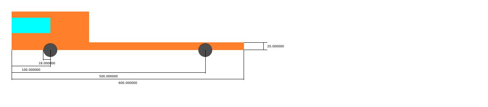

# Homework1
# _Meccanismo: motrice_
## Tecniche di programmazione avanzata 
## Anno 2020 - 2021

Il presente progetto prevede di costruire un file .svg di un certo device che abbia delle misure ben precise e successivamente si possa integrare con qualche altro device degli altri membri del corso.

In questo caso come device è stato scelto la motrice di un autotrasportatore che successivamente verrà integrato con un rimorchio prodotto da un altro membro del corso.

##MISURE
Le misure richieste per la creazione dell’file “.svg” sono:
-la larghezza del pianale
-l’altezza del pianale 
-la posizione x della ruota anteriore
-la posizione y della ruota posteriore
-i raggi delle ruote (che sono assunti uguali)

##LIMITI CHE LE MISURE DEVONO RISPETTARE
Le misure devono rispettare i seguenti limiti:
-le dimensioni del pianale non hanno alcun limite
-i raggi delle due ruote devono essere minori dell’altezza del pianale 
-la ruota anteriore deve essere situata nella prima metà del pianale
-la ruota posteriore deve essere situata nella seconda metà del pianale

Le misure degli altri componenti invece sono derivate dal programma, in particolare:
-la cabina si è alta 4 volte il pianale e larga 1/3
-il vetro è largo la metà della cabina e anche alto la metà, mentre è posto a 1/5 della sua altezza partendo dall’alto
-vetro, cabina e pianale sono allineati sulla linea frontale 
-le ruote sono incernierate su bordo inferiore del pianale 

##USO DEL PROGRAMMA PER L’UTENTE
Per usare il programma si può seguire la semplice guida che viene stampata all’inizio di esso:

~~~
GENERATORE DI IMMAGINI SVG
 Menu:
 [l] - caricare svg da file
 [c] - creare un nuovo svg
 [s] - salvare svg su file
 [q] - quit

 Cosa si desidera fare?
~~~

Lanciando il comando “l” viene richiesto di inserire il nome del file da cui si vuole caricare i parametri e in seguito essi vengono caricati per mezzo della funzione menini_parse().

Lanciando il comando “c” vengono richiesti uno alla volta i parametri, bloccando l’inserimento qualora essi non siano ammessi secondo i limiti di cui sopra.

Lanciando il comando “s” viene richiesto il nome del file su cui salvare il device e in seguito viene richiesto se si vuole salvare o meno anche le misure insieme ad esso.

Lanciando il comando “q” si esce invece dal programma
