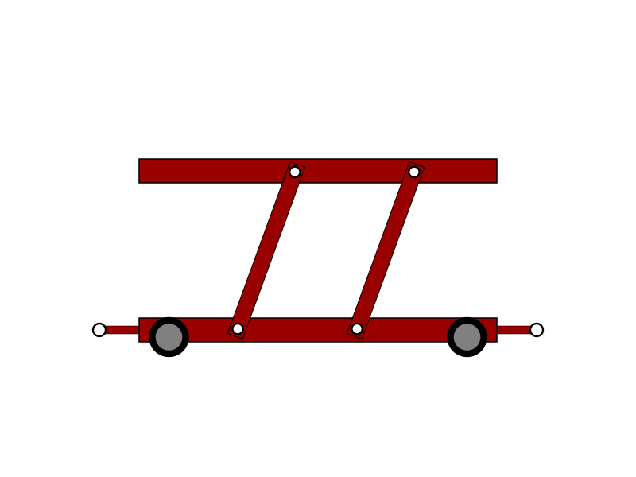
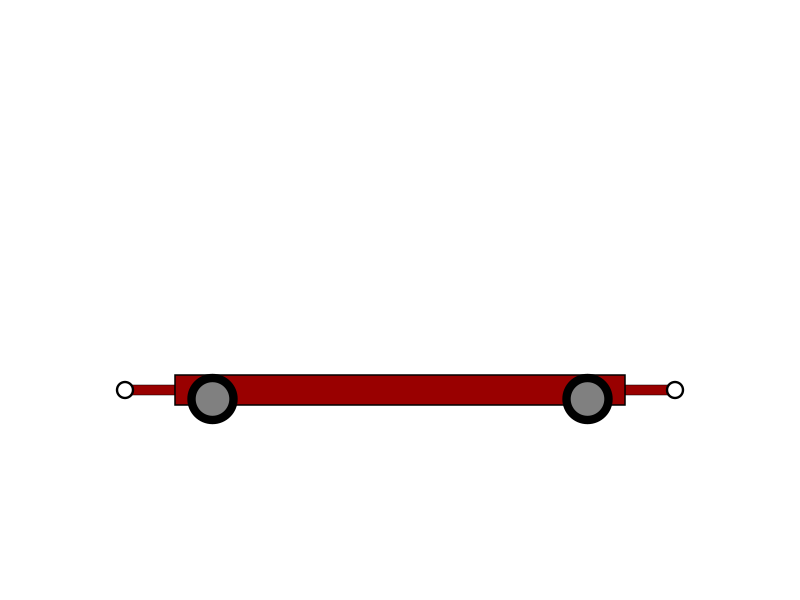
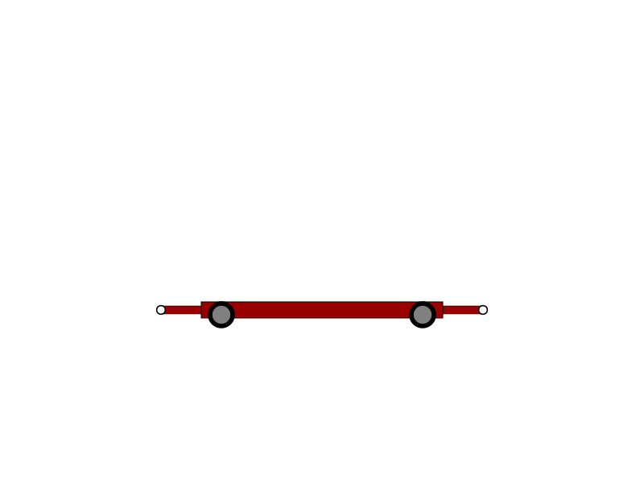
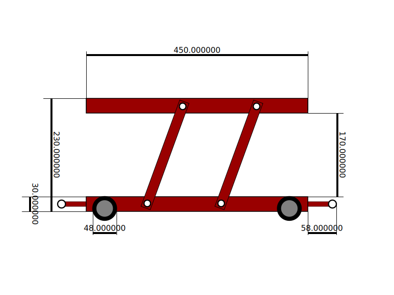
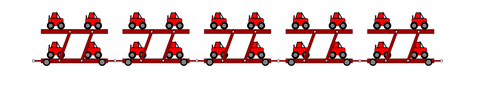

# DII - TPA: Homework 1

First homework of the Advanced Programming Techniques course. Dealine 2021-04-27

For usage, read below.
## Car Trailer

Create a car trailer basing on car's parameters you need to transport.

It's possible to export the generated drawing as .svg file.

With this tool you can obtain several devices, some of them in the following.

### Car trailer for 2 cars-per-floor. 2 floors

### Car trailer for 2 cars-per-floor. 1 floor

### Car trailer for 1 cars-per-floor. 1 floor

### Car trailer for 1 cars-per-floor. 2 floors

This would be structurally unstable. By this, the configuration is not allowed.

### Measures aviable as well

## Machines aviable as well
These are combination of multiple devices, with the implementation of a car's .svg file. A big thanks to **@GiacomoCorradini** and his awesome work.

# USAGE
## Constraints
There are some constraints you need to deal with:
- Trailer's length must be smaller than canvas width
- Trailer's height must be smaller than 5/4 canvas height
- 2 floors one car configuration is not allowed to preserve structural stability
- Car's length can't be smaller than 4/5 car's height (van configuration)
- More than 2 cars per trailer are not allowed
- More than 2 floors are not allowed

## Library's commands and structs
~~~C++
struct OselinDevice{

    std::string svg;
    Parameters param;
    float abslength;
    float absx;
    float absy;
    float offset;
    Oselin_Floor downfloor;
    Oselin_Floor upfloor;
    Oselin_Wheel frontwheel;
    Oselin_Wheel rearwheel;
    Oselin_Joint rearjoint;
    Oselin_Joint frontjoint;
    Oselin_Axis rearaxis;
    Oselin_Axis frontaxis;
};
~~~

The struct above is used for representing a trailer. It has attributes, such as offset (for x coordinate), absolute x and y (position) or absolute lenght and substructures used for storing other data.

Initialization of a trailer
~~~C++
OselinDevice *trailer;
~~~

All the data referred to trailer's dimensions and parameters are stored in the `OselinDevice` struct. Probably not the most efficient way to manage memory, but it definitely does the job.

~~~C++
oselin_init(OselinDevice *trailer, float params[], bool avoidsvg = false);
~~~

This function returns `0` if every single parameter given by the user respects the constraints, `1` otherwise. The boolean `avoidsvg`, if set to true, allows to bypass the svg width/height constraint check. It can be used for machine manipulations. However by default is set to false.

~~~C++
oselin_trigonometry(OselinDevice *trailer, bool automaticoffset=true);
~~~

This void function does all the math that allows the creation of SVG figures.

~~~C++
oselin_to_svg(OselinDevice *trailer, bool with_header=true, bool with_measures=false);
~~~

This function fills the .svg attribute of the trailer with drawing infos, svg-coded.

~~~C++
oselin_parsing(OselinDevice *trailer, string importedsvg);
~~~

This functions parses an existing .svg file, imported as a string. It extrapolates all the parametes, feeding the `OselinDevice` struct.

~~~C++
oselin_set(OselinDevice *trailer, float newparam);
~~~

This function allows to change one of the trailer's parameters.

## Trailer tool

Once compiled this tool can be easily exploited for trailer's svg manipulation. It supports both command line and graphical commands.

For command line usage:

~~~C++
./main <params>
~~~

For example

~~~
./main -h

-h | --help         allows you to read this awesome guide
-c | --create       create a trailer SVG                --create [SVG width] [SVG height] [Car length] [Car height] [Wheel radius] [Cars-per-trailer] [Floors]
-l | --load         load SVG from file                  --load [path]
-m | --machine      draw a train of trailers            
-i | --interface    use graphic menu (for lame people)
~~~

Invoking `./main -i` you will enter in the graphical menu

~~~
Welcome to the SVG TRAILER CREATOR
----------------------------------
Here's what you can do:
[1] - load SVG drawing from file
[2] - create a new trailer
[3] - save SVG draving to file
[4] - change a parameter
[5] - create a machine
[6] - exit
~~~

Here's the functions `load`, `create`, `save`, `change` and `machine` can be called, which exploit the library's fuctions above illustrated to manipulate trailer structs and data.

## Suggested measures
~~~C++
float SVGwidth  = 800;
float SVGheight = 600;
float length    = 100;
float carheight = 50;
float radius    = 16;
int ncars       = 2;
int nfloors     = 2;

~~~

## Machine commands

When typing
~~~C++
./main -m
~~~
or choosing
~~~
[5] - create a machine
~~~

it is possible to create a machine. By this the options aviable are

~~~
Here's what you can do:
[1] - load machine SVG drawing from file
[2] - create a new machine
[3] - save machine SVG drawing to file
[4] - change a parameter
[5] - return
~~~
